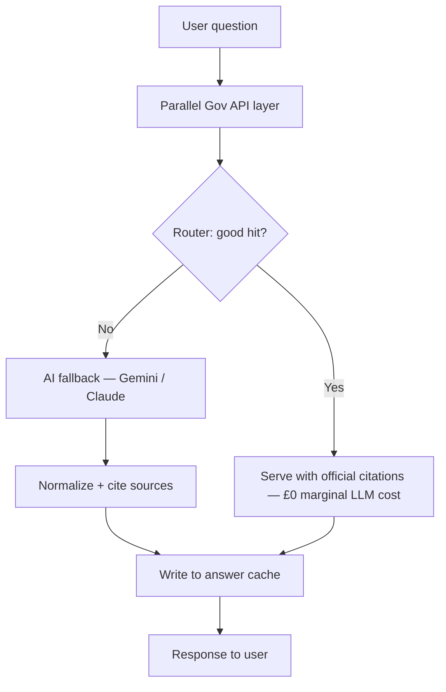

# RightsNow

**RightsNow** is a UK employment law AI assistant for workers in active workplace disputes. It is designed to be **cheaper**, **more defensible**, and **better cited** than “LLM-only” products by treating **official UK government sources as primary** and **generative AI as fallback**.

---

## Legal disclaimer

RightsNow provides **general information**, not legal advice. Employment outcomes depend on facts, jurisdiction, and procedure. **Always** confirm critical points with a qualified solicitor or trade union adviser, especially before deadlines (for example limitation dates or tribunal case management orders).

---

## Core architecture

| Principle | Detail |
|-----------|--------|
| **Primary** | Official UK government data and APIs (free, authoritative, no per-token cost). |
| **Fallback** | Gemini or Claude **only** when no adequate answer is returned from the Gov layer. |
| **Routing** | A smart router scores Gov hits and decides whether to skip the LLM. |
| **Caching** | Every served answer (Gov-only or blended) is **cached** (Supabase/Postgres) so repeated and similar questions avoid duplicate API cost. |

### Request flow



In plain terms:

1. **Question** → query **multiple Gov endpoints in parallel** (no charge from those publishers for typical read use; respect their terms and rate limits).
2. **Found?** → return immediately with **links and titles** from official material (**£0** LLM spend for that turn).
3. **Not found?** → call **one** AI provider with a **tight system prompt** and any Gov snippets as context.
4. **Cache** → store normalized question fingerprint + answer + provenance so the **next thousand similar questions** can be served from cache (**£0**).

This is typically **much cheaper** than sending every query straight to a frontier model, and it is **easier to explain** to users because official pages and legislation can be cited first.

---

## Planned government integrations (parallel layer)

The router is built to fan out to several connectors. These are **common, document-backed** UK sources suitable for a first implementation (exact paths and parsers land in later phases):

| # | Source | Role |
|---|--------|------|
| 1 | [GOV.UK Content API](https://www.gov.uk/api/content) | Primary guidance (Acas-linked topics, redundancy, dismissal, holidays, etc.). |
| 2 | [legislation.gov.uk](https://www.legislation.gov.uk/) | Statute and regulations text (employment rights acts, TUPE, etc.). |
| 3 | [data.gov.uk](https://data.gov.uk/) (CKAN API) | Datasets and reference material published as open data. |
| 4 | Tribunal / court **open data** and GOV.UK **decision listings** (where exposed) | Factual context on procedure and anonymised outcomes — **not** as substitute for case-specific advice. |
| 5 | Additional GOV.UK paths and **department** content surfaced via the same Content API pattern | Targeted fetch for “employment” and related tax/benefit pages where relevant. |

**Operational note:** Each upstream has **terms of use** and **rate limits**. Production deployments should cache aggressively, backoff on errors, and log provenance for every paragraph shown to the user.

---

## Tech stack (this repo)

- **Next.js 14** (App Router)
- **TypeScript** (strict)
- **Supabase** (client + server keys for auth and cached answers)
- **Zod** (validation for env, API payloads, and cache rows)
- **ESLint** + **Prettier**

---

## Getting started

### Prerequisites

- Node.js **18.18+** (LTS recommended)

After your first `npm install`, check `npm outdated` and align `next` / `eslint-config-next` with the latest **14.2.x** release referenced in the [Next.js security advisories](https://nextjs.org/blog) (the lockfile pins what you actually ship).

### Install

```bash
cd rightsnow
npm install
```

### Environment

1. Copy `.env.example` to `.env.local` (or edit the existing `.env.local` template).
2. Fill in **real** values from [Supabase](https://supabase.com/dashboard) and your AI provider(s).
3. Never commit `.env.local` — it is listed in `.gitignore`.

### Run locally

```bash
npm run dev
```

Open [http://localhost:3000](http://localhost:3000).

### Scripts

| Command | Purpose |
|---------|---------|
| `npm run dev` | Development server |
| `npm run build` | Production build |
| `npm run start` | Start production server |
| `npm run lint` | ESLint |
| `npm run format` | Prettier write |

---

## Project phases (IterLaw / RightsNow roadmap)

High-level phased plan for the **product** (distinct from early Cruser “Phase 0 step” handoff docs under `docs/CRUSER_*`).

| Phase | Focus |
|-------|--------|
| **0** | CI/CD + Azure deployment (Functions, Static Web Apps, secrets, RBAC). |
| **1** | Controlled Legal Answer Engine (AEE → ART → LVC → safety gate; citations; cache). |
| **2** | **Vision Engine / Document OCR** — upload or photo of employment documents; extract and clean text only; user confirmation before AEE/ART; audit + confidence; no legal advice from OCR. |
| **3** | Legal Review UI (queue, statuses, human oversight when answers are not approved). |
| **4** | AI Drafting Engine (e.g. SEA) **only** when upstream gates approve. |
| **5** | Case Workspace / User Documents (persistent matter context and libraries). |

**Full plan (flows, requirements, planned tables):** [`docs/ITERLAW_PROJECT_PLAN.md`](docs/ITERLAW_PROJECT_PLAN.md).

---

## Security reminders

- Keep **service role** keys **server-only** (Route Handlers, Server Actions, never `NEXT_PUBLIC_*`).
- Treat user questions as **sensitive personal data**; minimise retention and document your basis for processing under UK GDPR.

---

## Licence

Specify your licence in a later commit (for example MIT or proprietary).
