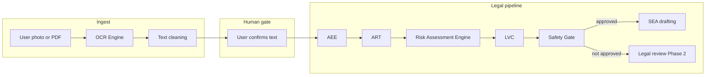

# IterLaw / RightsNow — project plan (phased roadmap)

This document is the **product and architecture plan** for IterLaw. Implementation is tracked separately in issues and PRs; nothing here is a commitment to ship order inside a phase.

**Stability rule:** **Legal Risk Assessment Engine (Phase 4)** is scheduled **after Phase 1 (Controlled Legal Answer Engine) and Phase 3 (Camera + OCR / Vision Engine) are stable**, plus **Phase 2 (Legal Review Pipeline)** where human oversight is required. It is **not** implemented in the codebase as of this roadmap revision.

---

## Phase overview

| Phase | Name | Summary |
|-------|------|---------|
| **0** | CI/CD + Azure deployment | Green pipelines; Azure Functions + Static Web Apps; secrets and RBAC documented (`docs/PHASE0_GATE.md`). |
| **1** | Controlled Legal Answer Engine | AEE → ART → LVC → safety gate; governed answers with citations and cache (`qa_pool`, `trusted_content`, review paths); no unconstrained legal generation. |
| **2** | Legal Review Pipeline | Human review queue, statuses, and workflows when automated legal output is not approved; connects to review tables and escalation from Phase 1. |
| **3** | Camera + OCR / Vision Engine | Upload or capture employment documents; **text extraction only** — no legal advice from OCR; user confirmation before any downstream legal pipeline. |
| **4** | **Legal Risk Assessment Engine** | **Planned module (not implemented):** rule-based risk scoring and **next-step** guidance from approved sources only — see dedicated section below. |
| **5** | AI Drafting Engine / SEA | Structured drafting **only** when upstream gates approve (including post–legal-review where applicable). |
| **6** | Case Workspace / User Documents | Persistent case context, document libraries, and user-facing organisation of matter materials. |

---

## Phase 2 — Legal Review Pipeline (planned)

### Purpose

When the Controlled Legal Answer path or safety gate **does not** approve output, or the user disputes automated results, **human legal review** is required. Phase 2 delivers the **pipeline and UI** for queues, statuses, assignment, and audit — not the substantive legal advice inside reviews (that remains with qualified reviewers).

### Relationship to other phases

- **Phase 1** produces candidates, `under_review` states, and structured payloads that **enqueue** review work.  
- **Phase 3 (OCR)** may create additional review load (e.g. low-confidence extraction, user disagreement with text).  
- **Phase 4 (Risk Assessment)** sets `requires_legal_review` and similar flags that **feed** this pipeline.  
- **Phase 5 (SEA)** must not draft from items still in **pending** review unless product rules explicitly allow a narrow automation path.

---

## Phase 3 — Vision Engine / Document OCR Engine (planned)

### Module name

**Vision Engine** (also referred to as **Document OCR Engine**).

### Purpose

Allow users to **upload** or **take a photo** of employment-related documents, for example:

- Dismissal letters  
- Grievance letters  
- Contracts  
- Payslips  
- Disciplinary letters  
- Appeal letters  
- ACAS documents  
- Tribunal documents  

### Core rule (non-negotiable)

**OCR only extracts text. It must not give legal advice.**  
Legal interpretation, risk scoring, and “what you should do” belong **downstream** (AEE / ART / **Legal Risk Assessment Engine (Phase 4)** / safety gate / legal review), and only after explicit user steps and consent rules below.

### End-to-end flow

1. User uploads a file or captures a photo.  
2. **Vision Engine** runs OCR / layout-aware extraction and produces raw text (plus metadata such as confidence).  
3. **Text cleaning and structuring** normalises whitespace, headings, page breaks, and obvious OCR artefacts; output is **draft structured text**, not a legal summary.  
4. **User confirms** the extracted text is accurate (edit allowed).  
5. **Only after confirmation**, the confirmed text may be passed into the **controlled legal pipeline** (AEE → ART → LVC → safety gate, with **Phase 4 Risk Assessment** inserted **after ART** and **before** the safety gate — see Phase 4) as **factual input** (not as authoritative legal truth).  
6. If the legal answer path does **not** approve output, route to **legal review** (Phase 2) per product rules.

### Architecture (high level)

```text
User Photo / PDF
  → OCR Engine
  → Text Cleaning
  → User Confirmation
  → AEE (extract facts)
  → ART (apply trusted legal rules)
  → Legal Risk Assessment Engine (Phase 4 — scores risk; no LLM in v1)
  → Safety Gate
  → SEA drafting (Phase 5 — only if approved)
```



### Requirements (planning)

| Area | Requirement |
|------|-------------|
| **Formats** | Support **image upload** (e.g. camera / gallery) and **PDF upload**. |
| **Storage** | Store **original file** securely (encryption at rest, access control, retention policy aligned with GDPR). |
| **Extracted text** | Store **extracted text** separately from the blob; version or link to confirmation event. |
| **Audit** | **Audit log** for: upload, extraction start/end, model/service used (if any), user edits, confirmation, and handoff to AEE/ART. |
| **Confidence** | Persist **per-field or per-document confidence** where the engine provides it; surface in UI. |
| **Low confidence** | **Flag low-confidence** segments or whole documents for **mandatory user review** before confirmation. |
| **Truth / sources** | **Never** treat extracted text as **legal truth** without **source checking** against authoritative materials and pipeline rules. |
| **AI / consent** | **Never** send document text to an LLM unless **user consent** is recorded **and** the **legal review flow** (when applicable) allows it. |
| **Separation of concerns** | OCR service returns **text + confidence + structure hints** only — no “you should…” or legal conclusions in the OCR response contract. |

### Planned database tables (schema TBD)

| Table | Role (planning) |
|-------|-----------------|
| **`documents`** | Original file metadata: owner, storage key, mime type, size, checksum, upload timestamp, retention class, link to case (Phase 6). |
| **`document_extractions`** | Extraction runs: raw text, cleaned text, structured JSON (if used), confidence aggregates, status (`pending` / `needs_review` / `confirmed`), FK to `documents`, link to user confirmation event. |
| **`ocr_audit_logs`** | Append-only audit trail: actor, action, payload references (not necessarily full PII in log row), correlation id, timestamps, and integration with broader app audit if present. |

Indexes, RLS, and encryption details are **out of scope** until implementation.

### Relationship to other phases

- **Phase 1** defines how **AEE / ART / Safety Gate** consume **user-confirmed factual text**. Phase 3 only **feeds** that pipeline after confirmation.  
- **Phase 2** absorbs failures and disputes from the safety gate and OCR edge cases (e.g. user disagrees with extraction).  
- **Phase 4** consumes the same factual inputs plus **trusted rules** to emit **risk metadata**; it must **not** run unconstrained generative legal advice.  
- **Phase 5 (SEA)** must remain **gated**: no drafting from unconfirmed or low-confidence OCR without explicit product rules.  
- **Phase 6** may unify **documents** with **case workspace** entities and permissions.

---

## Phase 4 — Legal Risk Assessment Engine (planned — **not implemented**)

### Module name

**Legal Risk Assessment Engine** (risk scoring and **next-step** suggestions only; **no** implementation in repo until Phase 1 + Phase 2 + Phase 3 are stable).

### Purpose

When a user:

- asks a legal question,  
- uploads a document,  
- takes a photo of a document (via Phase 3 confirmed text),  
- pastes employment evidence,  

the system should **assess legal risk** and **suggest what to do next** — using **trusted legal rules and approved content only**, not open-ended model “advice.”

### Inputs (design)

- User question (free text).  
- **Confirmed** OCR text (from Phase 3; never raw unconfirmed OCR as sole authority).  
- Uploaded document text (with same confirmation / provenance rules as OCR where applicable).  
- User-provided facts (structured where possible).  
- **Trusted legal rules only** (e.g. constants catalogue, reviewed rulesets, `qa_pool`, `trusted_content` — aligned with Phase 1 safety model).

### Outputs (design)

- **Risk level:** `low` | `medium` | `high` | `urgent`.  
- **Legal topic classification** (taxonomy TBD; must be finite and versioned).  
- **Missing facts checklist** (questions the user or reviewer must answer).  
- **Deadline warning** (templated, source-linked; no fabricated dates).  
- **Possible claim routes** (each item must cite an allowed source type — see Rules).  
- **Next recommended steps** (actionable, non–legally novel; may include “seek legal advice” / “legal review”).  
- **Evidence checklist** (documents or facts to obtain).  
- **`requires_legal_review`** boolean (feeds **Phase 2**).

### Rules (non-negotiable)

- **No hallucination** — no invented citations, tribunals, outcomes, or dates.  
- **No unsupported legal conclusions** — every risk output must map to at least one of:  
  - an **approved `qa_pool`** answer,  
  - a **`trusted_content`** extract,  
  - a **legal rule constant** (e.g. employment-law constants catalogue in `docs/PHASE2_ART_EMPLOYMENT_LAW_CONSTANTS_MAY2026.md` — documentation only until implemented),  
  - a **reviewed legal rule** (human or formally approved ruleset version).  
- **Do not connect this module directly to generative AI** for risk scoring in v1. **AI** (Phase 5) may **only** assist with **drafting wording** after the risk assessment is **rule-based** and **approved** by the safety gate / review policy.

### Example output shape (illustrative JSON — not an API contract)

```json
{
  "risk_level": "high",
  "topic": "dismissal",
  "reason": "Potential unfair dismissal issue detected, but service length and dismissal date are missing.",
  "missing_facts": [
    "employment start date",
    "dismissal date",
    "reason given by employer"
  ],
  "deadline_warning": "Tribunal time limits may apply. Confirm exact dismissal date.",
  "next_steps": [
    "Upload dismissal letter",
    "Confirm employment start date",
    "Check ACAS Early Conciliation deadline",
    "Send to legal review if uncertain"
  ],
  "requires_legal_review": true
}
```

Each field in a shipping design should later carry **`source_refs[]`** (ids into `qa_pool`, `trusted_content`, rule pack version, or review record) — **not** implemented in this roadmap pass.

### Architecture placement (target)

```text
User input / document / OCR text
  → AEE extracts facts
  → ART applies legal rules
  → Legal Risk Assessment Engine scores risk
  → Safety Gate validates output
  → SEA drafts next-step documents only if approved
```

**Note:** `LVC` (Legal Verification Controller) in `@rightsnow/legal-core` may run **adjacent to or within** the “ART → Risk → Safety” chain; exact ordering is an **implementation** decision. This roadmap fixes **product intent**: Risk Assessment is **rule-backed**, **source-mapped**, and **upstream of unconstrained drafting**.

### Relationship to other phases

- Depends on **Phase 1** data contracts (`qa_pool`, `trusted_content`, logs, review hooks).  
- Depends on **Phase 3** for **confirmed** document text quality.  
- Feeds **Phase 2** when `requires_legal_review` is true.  
- **Precedes Phase 5 (SEA)** so drafting never runs on unvalidated risk payloads.

---

## Phase 5 — AI Drafting Engine / SEA (planned)

Structured employment-law **drafting** (SEA) and related outputs **only** when **Phase 1–4** gates and **Phase 2** review policy allow. No drafting from raw OCR or unvalidated risk JSON.

---

## Phase 6 — Case Workspace / User Documents (planned)

Persistent case context, document libraries, permissions, and user-facing organisation of matter materials — integrates **documents** from Phase 3 with cases and review history.

---

## Document history

| Date | Change |
|------|--------|
| 2026-05-02 | Added Phase 2 Vision Engine / OCR plan; aligned phase numbering with IterLaw roadmap. |
| 2026-05-02 | Reordered phases: Legal Review → Phase 2, Vision/OCR → Phase 3; added **Phase 4 Legal Risk Assessment Engine** (design only); SEA → Phase 5; Case Workspace → Phase 6; updated diagrams and cross-references. |
