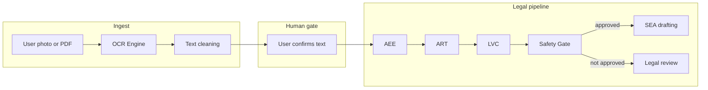

# IterLaw / RightsNow — project plan (phased roadmap)

This document is the **product and architecture plan** for IterLaw. Implementation is tracked separately in issues and PRs; nothing here is a commitment to ship order inside a phase.

---

## Phase overview

| Phase | Name | Summary |
|-------|------|---------|
| **0** | CI/CD + Azure deployment | Green pipelines; Functions + Static Web Apps; secrets and RBAC documented. |
| **1** | Controlled Legal Answer Engine | AEE → ART → safety gate; governed answers with citations and cache; no unconstrained legal generation. |
| **2** | Vision Engine / Document OCR Engine | Upload or capture employment documents; **text extraction only** — no legal advice from OCR; user confirmation before any downstream legal pipeline. |
| **3** | Legal Review UI | Human review queue, statuses, and workflows when automated legal output is not approved. |
| **4** | AI Drafting Engine | SEA and related drafting **only** when prior gates approve (including post–legal-review where applicable). |
| **5** | Case Workspace / User Documents | Persistent case context, document libraries, and user-facing organisation of matter materials. |

---

## Phase 2 — Vision Engine / Document OCR Engine (planned)

### Module name

**Vision Engine** (also referred to as **Document OCR Engine**).

### Purpose

Allow users to **upload** or **take a photo** of employment-related documents, for example:

- Dismissal letters  
- Grievance letters  
- Contracts  
- Payslips  
- Disciplinary letters  
- Appeal letters  
- ACAS documents  
- Tribunal documents  

### Core rule (non-negotiable)

**OCR only extracts text. It must not give legal advice.**  
Legal interpretation, risk scoring, and “what you should do” belong **downstream** (AEE / ART / safety gate / legal review), and only after explicit user steps and consent rules below.

### End-to-end flow

1. User uploads a file or captures a photo.  
2. **Vision Engine** runs OCR / layout-aware extraction and produces raw text (plus metadata such as confidence).  
3. **Text cleaning and structuring** normalises whitespace, headings, page breaks, and obvious OCR artefacts; output is **draft structured text**, not a legal summary.  
4. **User confirms** the extracted text is accurate (edit allowed).  
5. **Only after confirmation**, the confirmed text may be passed into the **controlled legal pipeline** (today’s code path includes **AEE → ART → LVC →** safety gate) as **factual input** (not as authoritative legal truth).  
6. If the legal answer path does **not** approve output, route to **legal review** per existing product rules.

### Architecture (high level)

```text
User Photo / PDF
  → OCR Engine
  → Text Cleaning
  → User Confirmation
  → AEE
  → ART
  → LVC (where implemented)
  → Safety Gate
  → SEA drafting (only if approved)
```



### Requirements (planning)

| Area | Requirement |
|------|-------------|
| **Formats** | Support **image upload** (e.g. camera / gallery) and **PDF upload**. |
| **Storage** | Store **original file** securely (encryption at rest, access control, retention policy aligned with GDPR). |
| **Extracted text** | Store **extracted text** separately from the blob; version or link to confirmation event. |
| **Audit** | **Audit log** for: upload, extraction start/end, model/service used (if any), user edits, confirmation, and handoff to AEE/ART. |
| **Confidence** | Persist **per-field or per-document confidence** where the engine provides it; surface in UI. |
| **Low confidence** | **Flag low-confidence** segments or whole documents for **mandatory user review** before confirmation. |
| **Truth / sources** | **Never** treat extracted text as **legal truth** without **source checking** against authoritative materials and pipeline rules. |
| **AI / consent** | **Never** send document text to an LLM unless **user consent** is recorded **and** the **legal review flow** (when applicable) allows it. |
| **Separation of concerns** | OCR service returns **text + confidence + structure hints** only — no “you should…” or legal conclusions in the OCR response contract. |

### Planned database tables (schema TBD)

| Table | Role (planning) |
|-------|-----------------|
| **`documents`** | Original file metadata: owner, storage key, mime type, size, checksum, upload timestamp, retention class, link to case (later phase). |
| **`document_extractions`** | Extraction runs: raw text, cleaned text, structured JSON (if used), confidence aggregates, status (`pending` / `needs_review` / `confirmed`), FK to `documents`, link to user confirmation event. |
| **`ocr_audit_logs`** | Append-only audit trail: actor, action, payload references (not necessarily full PII in log row), correlation id, timestamps, and integration with broader app audit if present. |

Indexes, RLS, and encryption details are **out of scope** until implementation.

### Relationship to other phases

- **Phase 1** defines how **AEE / ART / Safety Gate** consume **user-confirmed factual text**. Phase 2 only **feeds** that pipeline after confirmation.  
- **Phase 3** absorbs failures and disputes from the safety gate and OCR edge cases (e.g. user disagrees with extraction).  
- **Phase 4** (**SEA**) must remain **gated**: no drafting from unconfirmed or low-confidence OCR without explicit product rules.  
- **Phase 5** may unify **documents** with **case workspace** entities and permissions.

---

## Document history

| Date | Change |
|------|--------|
| 2026-05-02 | Added Phase 2 Vision Engine / OCR plan; aligned phase numbering with IterLaw roadmap. |
